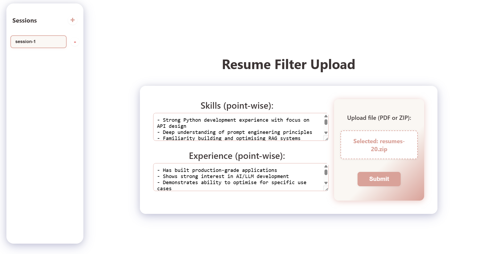
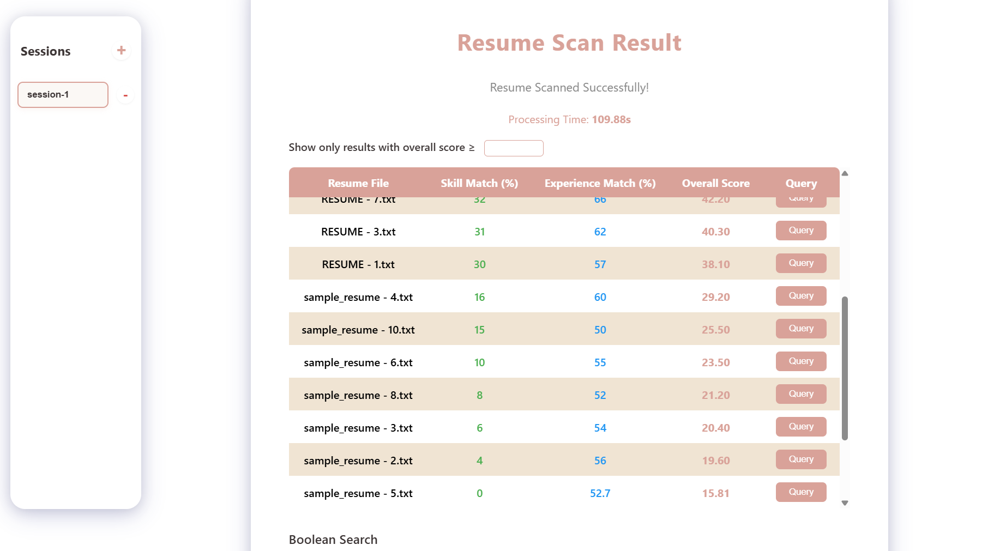
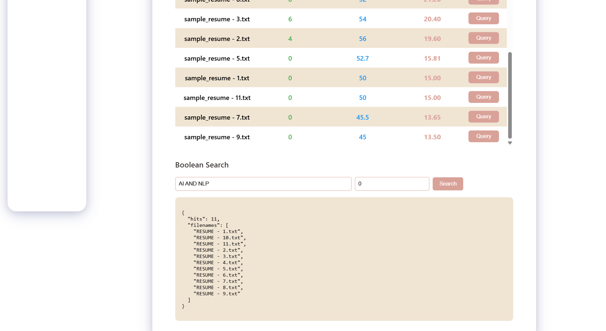
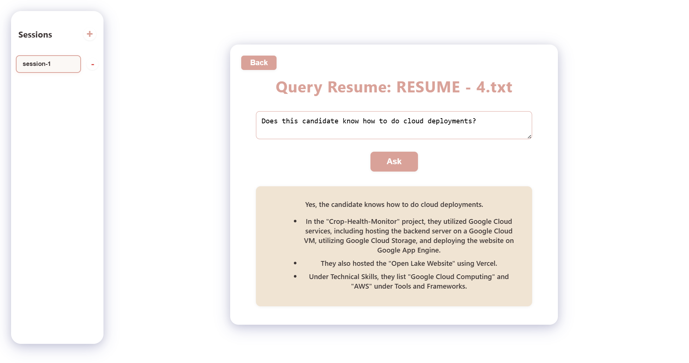

## There are 2 ways to locally to run this application
**Setup-1:** People who does not have docker setup in their systems

**Setup-2:** People with docker installed

---

# Setup-1:
**To run React Frontend:**
1. Install node package manager to run the React frontend
2. move to directory ./Resume_Filter/resume_filter
3. run the below command sequence
```
npm install
npm start
```
**To start the Fast-API Backend**
1. move to directory ./Resume_Filter/backend
2. Create a python venv using the requirement.txt file
3. run the command
```
uvicorn main:app --reload --port 8000
```

- in this setup you will have frontend and backend running in different terminals and communicating to each other
- open "localhost:3000" to view the website
---

# Setup-2:
1. be in the directory ./Resume_Filter
2. run the below command

```
docker compose up --build
```

- please wait until both the containers are created successfully
- in this setup automatically 2 containers will be created exposing their communication ports
- open "localhost:3000" to view the website

*Note- If the website is not running or not interacting with backend, please check the system firewall settings*

---

# Tutorial to run the application:
1. Enter the skills, experience information of the job in the 2 form field and upload the .pdf/.zip folder of resume's. You can use **sample_skills.txt** and **sample_experience.txt** provided in ./Resume_Filter as an example to fill in the form fields.


2. In result screen you can see the resumes ordered in a table with decreasing order of overall score. You can also see results whose score is greater than the value you set in the box above the table.


3. You can filter resumes with key words using the boolean search query below the results table. You can also do the search only on resumes whose score is greater than a predefined value by entering the number in the box next to query box.


4. In each row of the table you have query button, which you can use to do question answering like below.

#### Happy Solving!
